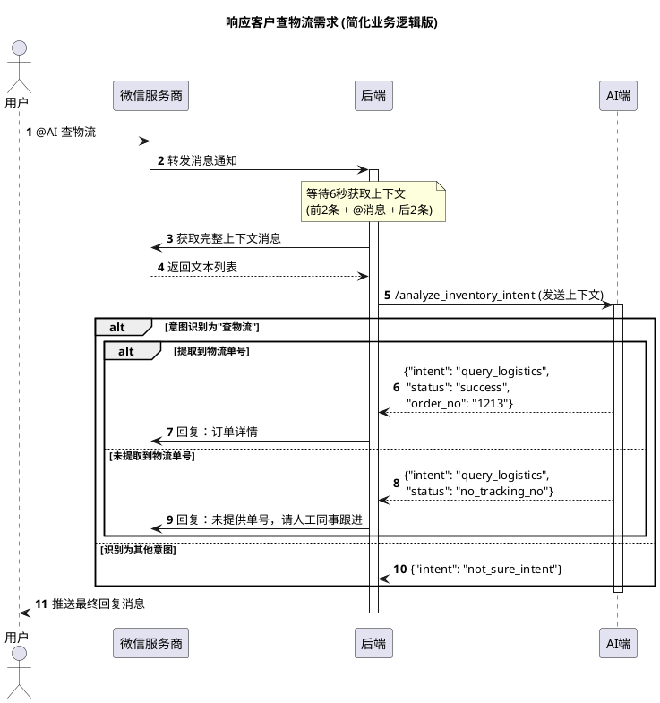
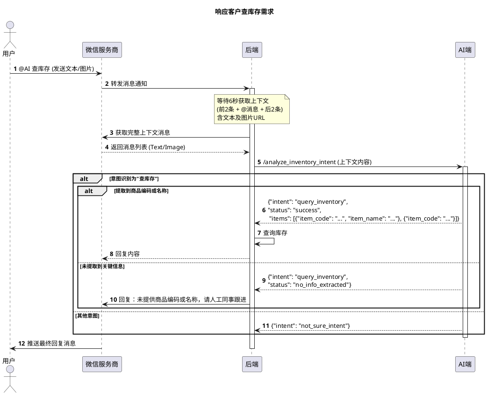

# Lucky Box AI

微信群聊客服 AI 服务。通过 LLM 识别客户意图（查物流/查库存），并生成打招呼、节日问候、客情维护等客服回复语，供后端调用。

## 配置

通过环境变量配置，或创建 `.env` 文件（参考 `.env.example`）：

| 变量 | 说明 |
|------|------|
| `TEXT_LLM_BASE_URL` | 纯文本模型 API 地址 |
| `TEXT_LLM_API_KEY` | 纯文本模型 Key |
| `TEXT_LLM_MODEL` | 纯文本模型名称 |
| `VISION_LLM_BASE_URL` | 图片问答模型 API 地址 |
| `VISION_LLM_API_KEY` | 图片问答模型 Key |
| `VISION_LLM_MODEL` | 图片问答模型名称 |

## 开发部署

```bash
# 创建虚拟环境
python -m venv .venv
source .venv/bin/activate

# 安装依赖
pip install -r requirements.txt

# 配置环境变量
cp .env.example .env
# 编辑 .env 填入实际的 API Key 等配置

# 启动开发服务器（热重载）
uvicorn app.main:app --reload
```

访问 http://localhost:8000/docs 查看接口文档。

## Docker 部署

### 国内服务器配置镜像加速（首次部署）

国内服务器无法直接拉取 Docker Hub 镜像，需先配置加速器：

```bash
sudo tee /etc/docker/daemon.json <<'EOF'
{
  "registry-mirrors": [
    "https://mirror.ccs.tencentyun.com",
    "https://docker.1ms.run",
    "https://docker.xuanyuan.me"
  ]
}
EOF
sudo systemctl daemon-reload
sudo systemctl restart docker
```

### 构建与运行

```bash
# 构建镜像
docker build -t lucky-box-ai .

# 运行（通过环境变量传入配置）
docker run -d -p 8000:8000 \
  -e TEXT_LLM_BASE_URL=https://api.openai.com/v1 \
  -e TEXT_LLM_API_KEY=sk-xxx \
  -e TEXT_LLM_MODEL=gpt-4o \
  -e VISION_LLM_BASE_URL=https://api.openai.com/v1 \
  -e VISION_LLM_API_KEY=sk-xxx \
  -e VISION_LLM_MODEL=gpt-4o \
  lucky-box-ai

# 或使用 .env 文件
docker run -d -p 8000:8000 --env-file .env lucky-box-ai
```

## 接口文档

### POST /analyze_inventory_intent

分析微信群聊上下文，识别客户意图并提取关键信息。

**请求体**

```json
{
  "before_messages": [
    {"type": "text", "content": "前面的文本消息"},
    {"type": "image", "url": "https://example.com/image.jpg"}
  ],
  "at_message": {"type": "text", "content": "@AI 有现货吗？"},
  "after_messages": []
}
```

| 字段 | 类型 | 必填 | 说明 |
|------|------|------|------|
| `before_messages` | Message[] | 否 | @AI 消息之前的上下文（最多2条） |
| `at_message` | Message | 是 | @AI 的消息本身 |
| `after_messages` | Message[] | 否 | @AI 消息之后的上下文（最多2条） |

Message 结构：

| 字段 | 类型 | 说明 |
|------|------|------|
| `type` | string | `"text"` 或 `"image"` |
| `content` | string | 文本内容（type 为 text 时） |
| `url` | string | 图片 URL（type 为 image 时） |

> 当消息中包含图片时，自动使用 vision 模型处理；纯文本则使用文本模型。

**响应体**

查物流：
```json
{"intent": "query_logistics", "status": "success", "order_no": "SF1234567890", "items": null}
{"intent": "query_logistics", "status": "no_tracking_no", "order_no": null, "items": null}
```

查库存：
```json
{"intent": "query_inventory", "status": "success", "order_no": null, "items": [{"item_code": "01028", "item_name": "宝可梦睡姿明盒"}]}
{"intent": "query_inventory", "status": "success", "order_no": null, "items": [{"item_code": "0102250"}, {"item_code": "0100700"}]}
{"intent": "query_inventory", "status": "no_info_extracted", "order_no": null, "items": null}
```

格式说明：

```json
{
  "intent": "query_inventory",
  "status": "success",
  "order_no": null,
  "items": [
    {
      "item_code": "商品编码，可选",
      "item_name": "商品名称，可选"
    }
  ]
}
```

> 查库存成功时，接口对外统一返回 `items` 数组。服务内部兼容 LLM 旧格式 `item_code` / `item_name`，会自动归一化为 `items`，但 API 响应不再保证返回顶层 `item_code` / `item_name`。
>
> `items` 中每个元素表示一个商品对象，可包含 `item_code`、`item_name`，未识别到的字段会省略。
>
> 当 `intent = "query_inventory"` 且 `status = "success"` 时，返回 `items`。
>
> 当前响应模型固定包含 `order_no`、`items` 字段；当该字段不适用于当前意图时，返回 `null`。
>
> 当 `intent = "query_inventory"` 且 `status = "no_info_extracted"` 时，返回 `"items": null`。

其他意图：
```json
{"intent": "not_sure_intent", "status": null, "order_no": null, "items": null}
```

错误响应（LLM 调用失败时透传错误信息）：
```json
{"error": "错误描述"}
```

### POST /greetings

生成打招呼回复语。

**请求体**

```json
{
  "prompt": "给新客户打一段招呼语",
  "product_info": "主营宝可梦周边、盲盒、手办，支持批发和零售"
}
```

| 字段 | 类型 | 必填 | 说明 |
|------|------|------|------|
| `prompt` | string | 是 | 打招呼提示词 |
| `product_info` | string | 是 | 产品和业务信息 |

**响应体**

```json
{
  "response": "您好呀，我们这边主营宝可梦周边，最近有不少现货新品，您可以告诉我想看哪一类。"
}
```

### POST /holiday_greetings

生成节日问候回复语。

**请求体**

```json
{
  "holiday": "中秋节",
  "time_now": "2026-09-17 10:00:00",
  "history": [
    {"role": "user", "content": "上次那批宝可梦睡姿还有吗"},
    {"role": "assistant", "content": "部分款还有现货，您要的话我可以给您整理"}
  ]
}
```

| 字段 | 类型 | 必填 | 说明 |
|------|------|------|------|
| `holiday` | string | 是 | 节日名称 |
| `time_now` | string | 是 | 当前时间 |
| `history` | HistoryMessage[] | 否 | 历史对话 |

HistoryMessage 结构：

| 字段 | 类型 | 说明 |
|------|------|------|
| `role` | string | `"user"` 或 `"assistant"` |
| `content` | string | 对话内容 |

**响应体**

```json
{
  "response": "中秋快乐，感谢您一直以来的支持，祝您阖家团圆，最近想看的款式也可以随时发我。"
}
```

### POST /customer_relationship_management

生成客情维护回复语。

**请求体**

```json
{
  "time_delay": "距离上次联系已过去30天",
  "time_now": "2026-03-18 15:30:00",
  "history": [
    {"role": "user", "content": "上次发我的新品图我看到了"},
    {"role": "assistant", "content": "好的，您有想重点了解的系列可以随时告诉我"}
  ]
}
```

| 字段 | 类型 | 必填 | 说明 |
|------|------|------|------|
| `time_delay` | string | 是 | 截止上次接触到现在过去了多久 |
| `time_now` | string | 是 | 当前时间 |
| `history` | HistoryMessage[] | 否 | 历史对话 |

**响应体**

```json
{
  "response": "这段时间一直没打扰您，最近我们这边到了一批新款宝可梦周边，您如果想看新品我可以给您发一版清单。"
}
```

### 时序图

#### 查物流流程



#### 查库存流程



## 测试

### 单元测试

```bash
pip install -r requirements.txt
pytest
```

### curl 集成测试

确保服务已启动（本地或 Docker），然后运行以下命令：

**1. 查物流 - 包含物流单号**

```bash
curl -X POST http://localhost:8000/analyze_inventory_intent \
  -H "Content-Type: application/json" \
  -d '{
    "before_messages": [],
    "at_message": {"type": "text", "content": "@AI 帮我查一下物流 SF1234567890"},
    "after_messages": []
  }'
```

期望返回：`intent: "query_logistics"`, `status: "success"`, `order_no` 包含单号。

**2. 查物流 - 未提供单号**

```bash
curl -X POST http://localhost:8000/analyze_inventory_intent \
  -H "Content-Type: application/json" \
  -d '{
    "before_messages": [],
    "at_message": {"type": "text", "content": "@AI 我的快递到哪了"},
    "after_messages": []
  }'
```

期望返回：`intent: "query_logistics"`, `status: "no_tracking_no"`。

**3. 查库存 - 纯文本，提取到商品名称**

```bash
curl -X POST http://localhost:8000/analyze_inventory_intent \
  -H "Content-Type: application/json" \
  -d '{
    "before_messages": [],
    "at_message": {"type": "text", "content": "@AI 宝可梦睡姿明盒有货吗？"},
    "after_messages": []
  }'
```

期望返回：`intent: "query_inventory"`, `status: "success"`，且 `items[0].item_name = "宝可梦睡姿明盒"`。

**4. 查库存 - 纯文本，提取到商品编码**

```bash
curl -X POST http://localhost:8000/analyze_inventory_intent \
  -H "Content-Type: application/json" \
  -d '{
    "before_messages": [],
    "at_message": {"type": "text", "content": "@AI 01028有现货吗？"},
    "after_messages": []
  }'
```

期望返回：`intent: "query_inventory"`, `status: "success"`，且 `items[0].item_code = "01028"`。

**5. 查库存 - 纯文本，未提取到商品信息**

```bash
curl -X POST http://localhost:8000/analyze_inventory_intent \
  -H "Content-Type: application/json" \
  -d '{
    "before_messages": [],
    "at_message": {"type": "text", "content": "@AI 有货吗"},
    "after_messages": []
  }'
```

期望返回：`intent: "query_inventory"`, `status: "no_info_extracted"`。

**6. 查库存 - 前文含图片（使用 vision 模型）**

```bash
curl -X POST http://localhost:8000/analyze_inventory_intent \
  -H "Content-Type: application/json" \
  -d '{
    "before_messages": [
      {"type": "image", "url": "https://img.pokemondb.net/artwork/large/pikachu.jpg"}
    ],
    "at_message": {"type": "text", "content": "@AI 有货吗"},
    "after_messages": []
  }'
```

期望返回：`intent: "query_inventory"`, `status: "success"`，且 `items` 中包含从图片中提取的商品信息。

### curl 本地图片集成测试

在仓库根目录运行，直接使用本地图片 `0.png`、`4.png`、`7.png` 测试新的 `items` 返回结构：

```bash
img0=$(base64 -w 0 0.png)
cat > /tmp/lucky_box_0.json <<EOF
{
  "before_messages": [
    {"type": "image", "url": "data:image/png;base64,${img0}"}
  ],
  "at_message": {"type": "text", "content": "这两个有货吗"},
  "after_messages": []
}
EOF
curl -X POST http://localhost:8000/analyze_inventory_intent \
  -H "Content-Type: application/json" \
  --data-binary @/tmp/lucky_box_0.json
```

```bash
img4=$(base64 -w 0 4.png)
cat > /tmp/lucky_box_4.json <<EOF
{
  "before_messages": [
    {"type": "image", "url": "data:image/png;base64,${img4}"}
  ],
  "at_message": {"type": "text", "content": "这个有货吗"},
  "after_messages": []
}
EOF
curl -X POST http://localhost:8000/analyze_inventory_intent \
  -H "Content-Type: application/json" \
  --data-binary @/tmp/lucky_box_4.json
```

```bash
img7=$(base64 -w 0 7.png)
cat > /tmp/lucky_box_7.json <<EOF
{
  "before_messages": [
    {"type": "image", "url": "data:image/png;base64,${img7}"}
  ],
  "at_message": {"type": "text", "content": "这个有货吗"},
  "after_messages": []
}
EOF
curl -X POST http://localhost:8000/analyze_inventory_intent \
  -H "Content-Type: application/json" \
  --data-binary @/tmp/lucky_box_7.json
```

期望返回：

- `0.png`：`intent: "query_inventory"`，`status: "success"`，且 `items` 至少包含 `0102250`、`0100700`
- `4.png`：`intent: "query_inventory"`，`status: "success"`，且 `items` 至少包含 `0102250`
- `7.png`：`intent: "query_inventory"`，`status: "success"`，且 `items` 至少包含 `0100700`

**7. 其他意图**

```bash
curl -X POST http://localhost:8000/analyze_inventory_intent \
  -H "Content-Type: application/json" \
  -d '{
    "before_messages": [],
    "at_message": {"type": "text", "content": "@AI 你好"},
    "after_messages": []
  }'
```

期望返回：`intent: "not_sure_intent"`。

**8. 完整上下文（前文 + @消息 + 后续消息）**

```bash
curl -X POST http://localhost:8000/analyze_inventory_intent \
  -H "Content-Type: application/json" \
  -d '{
    "before_messages": [
      {"type": "text", "content": "我之前买的那个订单"},
      {"type": "text", "content": "单号是 YT9876543210"}
    ],
    "at_message": {"type": "text", "content": "@AI 帮我查下物流"},
    "after_messages": [
      {"type": "text", "content": "谢谢"}
    ]
  }'
```

期望返回：`intent: "query_logistics"`, `status: "success"`, `order_no: "YT9876543210"`。

**9. 打招呼**

```bash
curl -X POST http://localhost:8000/greetings \
  -H "Content-Type: application/json" \
  -d '{
    "prompt": "给新客户打一段招呼语",
    "product_info": "主营宝可梦周边、盲盒、手办，支持批发和零售"
  }'
```

期望返回：`response` 为一段可直接发送给客户的打招呼内容。

**10. 节日问候回复语**

```bash
curl -X POST http://localhost:8000/holiday_greetings \
  -H "Content-Type: application/json" \
  -d '{
    "holiday": "中秋节",
    "time_now": "2026-09-17 10:00:00",
    "history": [
      {"role": "user", "content": "上次那批宝可梦睡姿还有吗"},
      {"role": "assistant", "content": "部分款还有现货，您要的话我可以给您整理"}
    ]
  }'
```

期望返回：`response` 为一段节日问候内容。

**11. 客情维护回复语**

```bash
curl -X POST http://localhost:8000/customer_relationship_management \
  -H "Content-Type: application/json" \
  -d '{
    "time_delay": "距离上次联系已过去30天",
    "time_now": "2026-03-18 15:30:00",
    "history": [
      {"role": "user", "content": "上次发我的新品图我看到了"},
      {"role": "assistant", "content": "好的，您有想重点了解的系列可以随时告诉我"}
    ]
  }'
```

期望返回：`response` 为一段客情维护内容。
